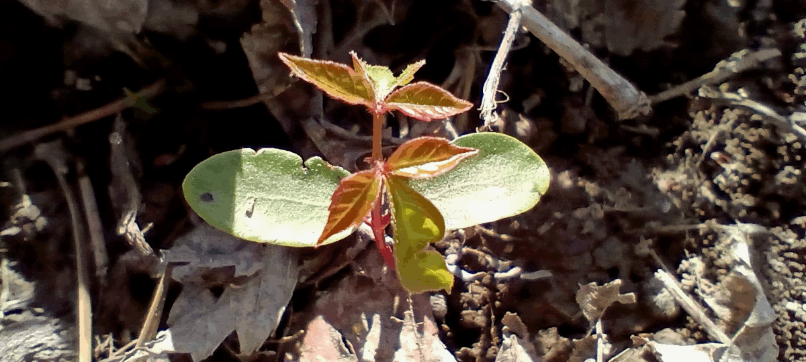

The ultimate guide to identifying poison ivy, this guide will go over how to identify poison ivy in any of its forms, its looks-alikes, and ways to treat the rash.

**Topics Covered in This Article**:

- [Identifying Poison Ivy](#identifying-poison-ivy)
- [Poison Ivy Look-Alikes](#poison-ivy-look-alikes)
- [Methods To Treat Poison Ivy](#methods-to-treat-poison-ivy)

### Identifying Poison Ivy

Poison ivy has three different phases it goes through when it changes appearances. The first stage is the seedling stage, the second stage occurs when the plant begins to form into a vine, and the third stage occurs when the plant is mature. 

The seedling of poison ivy varies the most in appearance from the mature plant, and has been the most difficult for me to identify. 

I initially had a lot of difficulty finding a picture of a posion ivy seedling, however, I now have many pictures of the seedling that I intend to share to make the seedling more obvious to others.

The seedling will have two oblong leaves that 

### Poison Ivy Look-Alikes

### Methods To Treat Poison Ivy